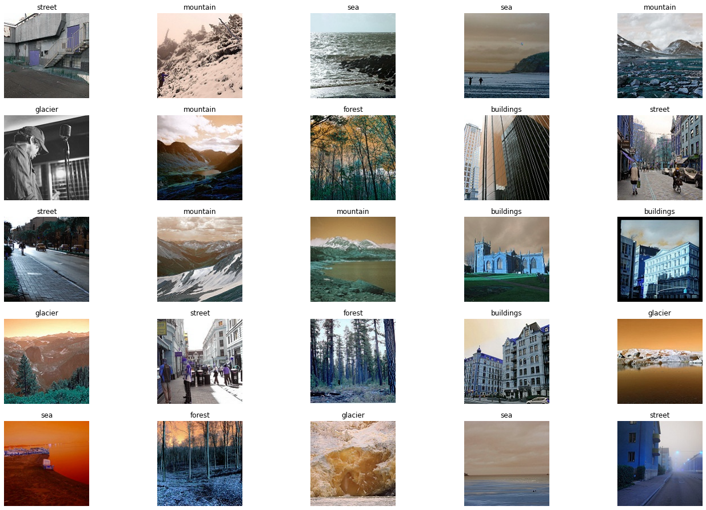
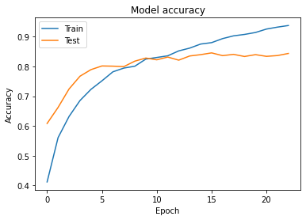
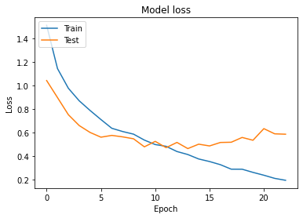
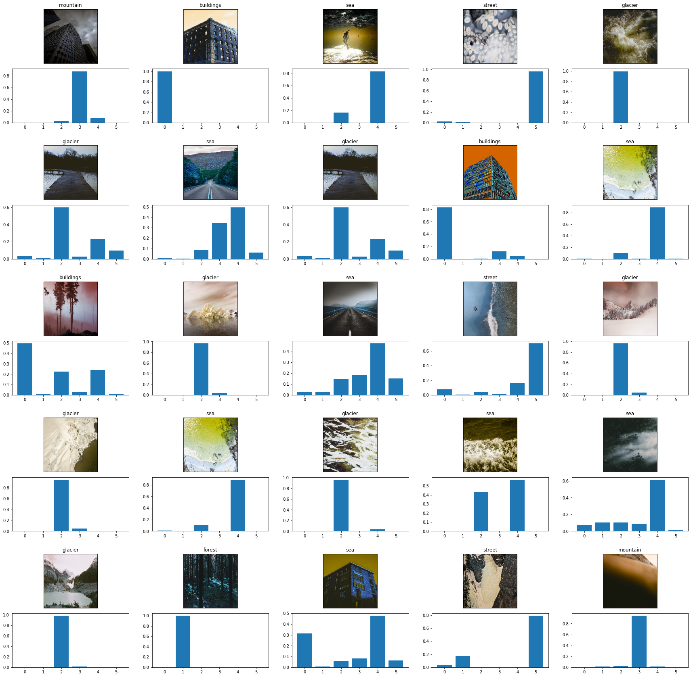

# Image classification model for buildings, streets, forests, sea and glaciers

### Initiating the necessary imports


```python
import tensorflow.keras.layers as Layers
import tensorflow.keras.activations as Actications
import tensorflow.keras.models as Models
import tensorflow.keras.optimizers as Optimizer
import tensorflow.keras.metrics as Metrics
import tensorflow.keras.utils as Utils
from keras.utils.vis_utils import model_to_dot
import os
import matplotlib.pyplot as plot
import cv2
import numpy as np
from sklearn.utils import shuffle
from sklearn.metrics import confusion_matrix as CM
from random import randint
from IPython.display import SVG
import matplotlib.gridspec as gridspec
```

    Using TensorFlow backend.
    

## Preparing the data and Resizing it


```python
def get_images(directory):
    Images = []
    Labels = []  # 0 for Building , 1 for forest, 2 for glacier, 3 for mountain, 4 for Sea , 5 for Street
    label = 0
    
    for labels in os.listdir(directory): #Main Directory where each class label is present as folder name.
        if labels == 'glacier': #Folder contain Glacier Images get the '2' class label.
            label = 2
        elif labels == 'sea':
            label = 4
        elif labels == 'buildings':
            label = 0
        elif labels == 'forest':
            label = 1
        elif labels == 'street':
            label = 5
        elif labels == 'mountain':
            label = 3
        
        for image_file in os.listdir(directory+labels): #Extracting the file name of the image from Class Label folder
            image = cv2.imread(directory+labels+r'/'+image_file) #Reading the image (OpenCV)
            image = cv2.resize(image,(150,150)) #Resize the image, Some images are different sizes. (Resizing is very Important)
            Images.append(image)
            Labels.append(label)
    
    return shuffle(Images,Labels,random_state=817328462) #Shuffle the dataset you just prepared.

def get_classlabel(class_code):
    labels = {2:'glacier', 4:'sea', 0:'buildings', 1:'forest', 5:'street', 3:'mountain'}
    
    return labels[class_code]


```

### Loading the data using the function we just created, and converting it to numpy arrays


```python
Images, Labels = get_images('data/seg_train/') #Extract the training images from the folders.

Images = np.array(Images) #converting the list of images to numpy array.
Labels = np.array(Labels)
```


```python
print("Shape of Images:",Images.shape)
print("Shape of Labels:",Labels.shape)
```

    Shape of Images: (14034, 150, 150, 3)
    Shape of Labels: (14034,)
    

### Checking some images of our dataset


```python
f,ax = plot.subplots(5,5) 
f.subplots_adjust(0,0,3,3)
for i in range(0,5,1):
    for j in range(0,5,1):
        rnd_number = randint(0,len(Images))
        ax[i,j].imshow(Images[rnd_number])
        ax[i,j].set_title(get_classlabel(Labels[rnd_number]))
        ax[i,j].axis('off')
```





### Creating our convolutional neural network CNN and Compiling


```python
model = Models.Sequential()

model.add(Layers.Conv2D(200,kernel_size=(3,3),activation='relu',input_shape=(150,150,3)))
model.add(Layers.Conv2D(180,kernel_size=(3,3),activation='relu'))
model.add(Layers.MaxPool2D(5,5))
model.add(Layers.Conv2D(180,kernel_size=(3,3),activation='relu'))
model.add(Layers.Conv2D(140,kernel_size=(3,3),activation='relu'))
model.add(Layers.Conv2D(100,kernel_size=(3,3),activation='relu'))
model.add(Layers.Conv2D(50,kernel_size=(3,3),activation='relu'))
model.add(Layers.MaxPool2D(5,5))
model.add(Layers.Flatten())
model.add(Layers.Dense(180,activation='relu'))
model.add(Layers.Dense(100,activation='relu'))
model.add(Layers.Dense(50,activation='relu'))
model.add(Layers.Dropout(rate=0.5))
model.add(Layers.Dense(6,activation='softmax'))

model.compile(optimizer=Optimizer.Adam(lr=0.0001),loss='sparse_categorical_crossentropy',metrics=['accuracy'])

model.summary()

```

    Model: "sequential"
    _________________________________________________________________
    Layer (type)                 Output Shape              Param #   
    =================================================================
    conv2d (Conv2D)              (None, 148, 148, 200)     5600      
    _________________________________________________________________
    conv2d_1 (Conv2D)            (None, 146, 146, 180)     324180    
    _________________________________________________________________
    max_pooling2d (MaxPooling2D) (None, 29, 29, 180)       0         
    _________________________________________________________________
    conv2d_2 (Conv2D)            (None, 27, 27, 180)       291780    
    _________________________________________________________________
    conv2d_3 (Conv2D)            (None, 25, 25, 140)       226940    
    _________________________________________________________________
    conv2d_4 (Conv2D)            (None, 23, 23, 100)       126100    
    _________________________________________________________________
    conv2d_5 (Conv2D)            (None, 21, 21, 50)        45050     
    _________________________________________________________________
    max_pooling2d_1 (MaxPooling2 (None, 4, 4, 50)          0         
    _________________________________________________________________
    flatten (Flatten)            (None, 800)               0         
    _________________________________________________________________
    dense (Dense)                (None, 180)               144180    
    _________________________________________________________________
    dense_1 (Dense)              (None, 100)               18100     
    _________________________________________________________________
    dense_2 (Dense)              (None, 50)                5050      
    _________________________________________________________________
    dropout (Dropout)            (None, 50)                0         
    _________________________________________________________________
    dense_3 (Dense)              (None, 6)                 306       
    =================================================================
    Total params: 1,187,286
    Trainable params: 1,187,286
    Non-trainable params: 0
    _________________________________________________________________
    

### Training the model


```python
trained = model.fit(Images,Labels,epochs=40,validation_split=0.30)
```

#### To avoid overfitting we reduced the number of epochs


```python
trained = model.fit(Images,Labels,epochs=23,validation_split=0.30)
```

    Train on 9823 samples, validate on 4211 samples
    Epoch 1/23
    9823/9823 [==============================] - 330s 34ms/sample - loss: 1.5127 - accuracy: 0.4119 - val_loss: 1.0421 - val_accuracy: 0.6084
    Epoch 2/23
    9823/9823 [==============================] - 317s 32ms/sample - loss: 1.1441 - accuracy: 0.5608 - val_loss: 0.8971 - val_accuracy: 0.6623
    Epoch 3/23
    9823/9823 [==============================] - 317s 32ms/sample - loss: 0.9765 - accuracy: 0.6319 - val_loss: 0.7514 - val_accuracy: 0.7243
    Epoch 4/23
    9823/9823 [==============================] - 318s 32ms/sample - loss: 0.8697 - accuracy: 0.6855 - val_loss: 0.6590 - val_accuracy: 0.7673
    Epoch 5/23
    9823/9823 [==============================] - 318s 32ms/sample - loss: 0.7875 - accuracy: 0.7231 - val_loss: 0.6004 - val_accuracy: 0.7894
    Epoch 6/23
    9823/9823 [==============================] - 318s 32ms/sample - loss: 0.7101 - accuracy: 0.7517 - val_loss: 0.5600 - val_accuracy: 0.8017
    Epoch 7/23
    9823/9823 [==============================] - 319s 32ms/sample - loss: 0.6358 - accuracy: 0.7820 - val_loss: 0.5752 - val_accuracy: 0.8010
    Epoch 8/23
    9823/9823 [==============================] - 318s 32ms/sample - loss: 0.6082 - accuracy: 0.7946 - val_loss: 0.5628 - val_accuracy: 0.7996
    Epoch 9/23
    9823/9823 [==============================] - 317s 32ms/sample - loss: 0.5859 - accuracy: 0.8009 - val_loss: 0.5464 - val_accuracy: 0.8179
    Epoch 10/23
    9823/9823 [==============================] - 318s 32ms/sample - loss: 0.5352 - accuracy: 0.8247 - val_loss: 0.4779 - val_accuracy: 0.8283
    Epoch 11/23
    9823/9823 [==============================] - 317s 32ms/sample - loss: 0.4972 - accuracy: 0.8302 - val_loss: 0.5244 - val_accuracy: 0.8224
    Epoch 12/23
    9823/9823 [==============================] - 318s 32ms/sample - loss: 0.4823 - accuracy: 0.8358 - val_loss: 0.4708 - val_accuracy: 0.8316
    Epoch 13/23
    9823/9823 [==============================] - 317s 32ms/sample - loss: 0.4379 - accuracy: 0.8523 - val_loss: 0.5154 - val_accuracy: 0.8212
    Epoch 14/23
    9823/9823 [==============================] - 318s 32ms/sample - loss: 0.4123 - accuracy: 0.8617 - val_loss: 0.4629 - val_accuracy: 0.8352
    Epoch 15/23
    9823/9823 [==============================] - 317s 32ms/sample - loss: 0.3745 - accuracy: 0.8753 - val_loss: 0.5004 - val_accuracy: 0.8397
    Epoch 16/23
    9823/9823 [==============================] - 317s 32ms/sample - loss: 0.3527 - accuracy: 0.8801 - val_loss: 0.4855 - val_accuracy: 0.8456
    Epoch 17/23
    9823/9823 [==============================] - 317s 32ms/sample - loss: 0.3258 - accuracy: 0.8936 - val_loss: 0.5150 - val_accuracy: 0.8364
    Epoch 18/23
    9823/9823 [==============================] - 318s 32ms/sample - loss: 0.2876 - accuracy: 0.9029 - val_loss: 0.5170 - val_accuracy: 0.8407
    Epoch 19/23
    9823/9823 [==============================] - 318s 32ms/sample - loss: 0.2873 - accuracy: 0.9077 - val_loss: 0.5578 - val_accuracy: 0.8335
    Epoch 20/23
    9823/9823 [==============================] - 317s 32ms/sample - loss: 0.2604 - accuracy: 0.9142 - val_loss: 0.5339 - val_accuracy: 0.8397
    Epoch 21/23
    9823/9823 [==============================] - 318s 32ms/sample - loss: 0.2361 - accuracy: 0.9257 - val_loss: 0.6327 - val_accuracy: 0.8340
    Epoch 22/23
    9823/9823 [==============================] - 317s 32ms/sample - loss: 0.2093 - accuracy: 0.9322 - val_loss: 0.5886 - val_accuracy: 0.8366
    Epoch 23/23
    9823/9823 [==============================] - 317s 32ms/sample - loss: 0.1929 - accuracy: 0.9376 - val_loss: 0.5853 - val_accuracy: 0.8437
    

### Checking the accuracy on the test data


```python
plot.plot(trained.history['accuracy'])
plot.plot(trained.history['val_accuracy'])
plot.title('Model accuracy')
plot.ylabel('Accuracy')
plot.xlabel('Epoch')
plot.legend(['Train', 'Test'], loc='upper left')
plot.show()

plot.plot(trained.history['loss'])
plot.plot(trained.history['val_loss'])
plot.title('Model loss')
plot.ylabel('Loss')
plot.xlabel('Epoch')
plot.legend(['Train', 'Test'], loc='upper left')
plot.show()
```








```python
test_images,test_labels = get_images('data/seg_test/')
test_images = np.array(test_images)
test_labels = np.array(test_labels)
model.evaluate(test_images,test_labels, verbose=1)
model.save("OurModel.h5")
```

    3000/3000 [==============================] - 20s 7ms/sample - loss: 0.6027 - accuracy: 0.8440
    


    [0.6027055463790894, 0.844]


## Testing the model on our own data

#### uploading the data and reshaping it


```python
pred_images,no_labels = get_images('data/seg_pred/')
pred_images = np.array(pred_images)
pred_images.shape
```


    (198, 150, 150, 3)


### Cheking its accuracy with a graph


```python
fig = plot.figure(figsize=(30, 30))
outer = gridspec.GridSpec(5, 5, wspace=0.2, hspace=0.2)

for i in range(25):
    inner = gridspec.GridSpecFromSubplotSpec(2, 1,subplot_spec=outer[i], wspace=0.1, hspace=0.1)
    rnd_number = randint(0,len(pred_images))
    pred_image = np.array([pred_images[rnd_number]])
    pred_class = get_classlabel(model.predict_classes(pred_image)[0])
    pred_prob = model.predict(pred_image).reshape(6)
    for j in range(2):
        if (j%2) == 0:
            ax = plot.Subplot(fig, inner[j])
            ax.imshow(pred_image[0])
            ax.set_title(pred_class)
            ax.set_xticks([])
            ax.set_yticks([])
            fig.add_subplot(ax)
        else:
            ax = plot.Subplot(fig, inner[j])
            ax.bar([0,1,2,3,4,5],pred_prob)
            fig.add_subplot(ax)


fig.show()
```

    c:\users\pc-4905\anaconda3\envs\tensorflow\lib\site-packages\ipykernel_launcher.py:24: UserWarning: Matplotlib is currently using module://ipykernel.pylab.backend_inline, which is a non-GUI backend, so cannot show the figure.
    





## Fine Tuning our model with VGG16

### Importing the Model


```python
from keras.applications import VGG16
#Load the VGG model
vgg_conv = VGG16(weights='imagenet', include_top=False, input_shape=(150, 150, 3))
```

    Downloading data from https://github.com/fchollet/deep-learning-models/releases/download/v0.1/vgg16_weights_tf_dim_ordering_tf_kernels_notop.h5
    58892288/58889256 [==============================] - 244s 4us/step
    


```python
# Freeze the layers on our model
for layer in model.layers:
    layer.trainable = False
# Check the trainable status of the individual layers
for layer in model.layers:
    print(layer, layer.trainable)
```

    <tensorflow.python.keras.layers.convolutional.Conv2D object at 0x00000273A4E85808> False
    <tensorflow.python.keras.layers.convolutional.Conv2D object at 0x00000273A52D2148> False
    <tensorflow.python.keras.layers.pooling.MaxPooling2D object at 0x00000273A535DCC8> False
    <tensorflow.python.keras.layers.convolutional.Conv2D object at 0x00000273A536AFC8> False
    <tensorflow.python.keras.layers.convolutional.Conv2D object at 0x00000273A52EDDC8> False
    <tensorflow.python.keras.layers.convolutional.Conv2D object at 0x00000273A5372088> False
    <tensorflow.python.keras.layers.convolutional.Conv2D object at 0x00000273A5372688> False
    <tensorflow.python.keras.layers.pooling.MaxPooling2D object at 0x00000273A536ADC8> False
    <tensorflow.python.keras.layers.core.Flatten object at 0x00000273AB6D2648> False
    <tensorflow.python.keras.layers.core.Dense object at 0x00000273A5375F88> False
    <tensorflow.python.keras.layers.core.Dense object at 0x00000273AB6DFD48> False
    <tensorflow.python.keras.layers.core.Dense object at 0x00000273AB6E5548> False
    <tensorflow.python.keras.layers.core.Dropout object at 0x00000273AB6DFE48> False
    <tensorflow.python.keras.layers.core.Dense object at 0x00000273A4E6F648> False
    


```python
from keras.models import load_model
model = Models.Sequential()
our_model = load_model('OurModel.h5')
model.add(our_model)
model.add(vgg_conv)
# Show a summary of the model. Check the number of trainable parameters
model.summary()
```


    ---------------------------------------------------------------------------

    OSError                                   Traceback (most recent call last)

    <ipython-input-29-9206ff04cf92> in <module>
          1 from keras.models import load_model
    ----> 2 our_model = load_model('OurModel.h5')
          3 model.add
          4 model.add(vgg_conv)
          5 # Show a summary of the model. Check the number of trainable parameters
    

    c:\users\pc-4905\anaconda3\envs\tensorflow\lib\site-packages\keras\engine\saving.py in load_wrapper(*args, **kwargs)
        490                 os.remove(tmp_filepath)
        491             return res
    --> 492         return load_function(*args, **kwargs)
        493 
        494     return load_wrapper
    

    c:\users\pc-4905\anaconda3\envs\tensorflow\lib\site-packages\keras\engine\saving.py in load_model(filepath, custom_objects, compile)
        581 
        582     if H5Dict.is_supported_type(filepath):
    --> 583         with H5Dict(filepath, mode='r') as h5dict:
        584             model = _deserialize_model(h5dict, custom_objects, compile)
        585     elif hasattr(filepath, 'write') and callable(filepath.write):
    

    c:\users\pc-4905\anaconda3\envs\tensorflow\lib\site-packages\keras\utils\io_utils.py in __init__(self, path, mode)
        189             self._is_file = False
        190         elif isinstance(path, six.string_types) or _is_path_instance(path):
    --> 191             self.data = h5py.File(path, mode=mode)
        192             self._is_file = True
        193         elif isinstance(path, dict):
    

    c:\users\pc-4905\anaconda3\envs\tensorflow\lib\site-packages\h5py\_hl\files.py in __init__(self, name, mode, driver, libver, userblock_size, swmr, rdcc_nslots, rdcc_nbytes, rdcc_w0, track_order, **kwds)
        406                 fid = make_fid(name, mode, userblock_size,
        407                                fapl, fcpl=make_fcpl(track_order=track_order),
    --> 408                                swmr=swmr)
        409 
        410             if isinstance(libver, tuple):
    

    c:\users\pc-4905\anaconda3\envs\tensorflow\lib\site-packages\h5py\_hl\files.py in make_fid(name, mode, userblock_size, fapl, fcpl, swmr)
        171         if swmr and swmr_support:
        172             flags |= h5f.ACC_SWMR_READ
    --> 173         fid = h5f.open(name, flags, fapl=fapl)
        174     elif mode == 'r+':
        175         fid = h5f.open(name, h5f.ACC_RDWR, fapl=fapl)
    

    h5py\_objects.pyx in h5py._objects.with_phil.wrapper()
    

    h5py\_objects.pyx in h5py._objects.with_phil.wrapper()
    

    h5py\h5f.pyx in h5py.h5f.open()
    

    OSError: Unable to open file (file signature not found)

